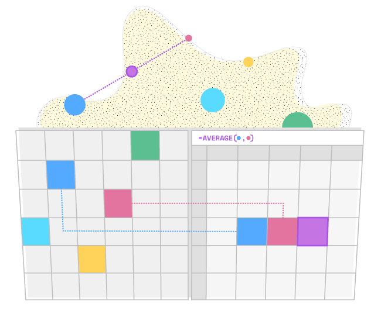
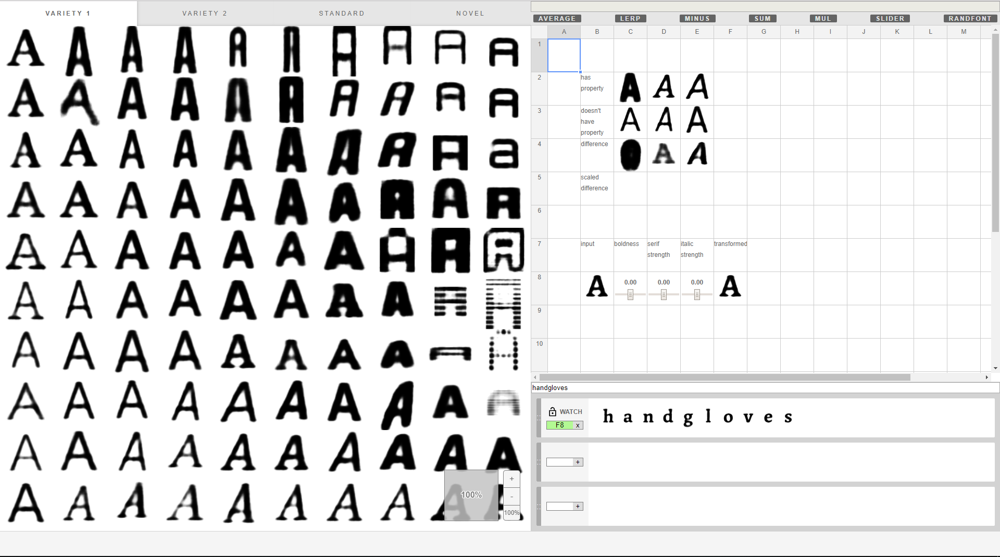
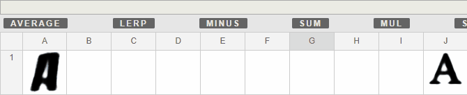
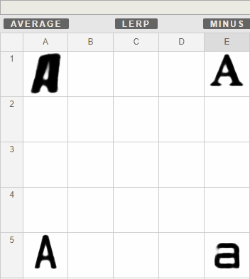
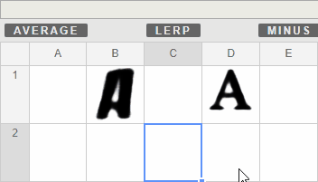
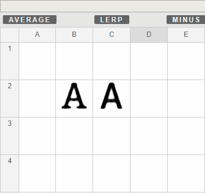
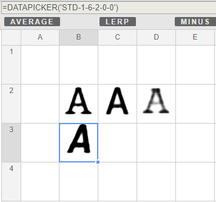
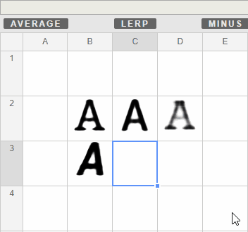
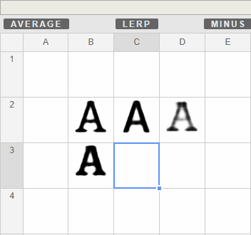

# SpaceSheets: Design Experimentation in Latent Space
 _A spreadsheet interface to explore the latent spaces of generative image models_

# Overview

The _SpaceSheet_ is a general purpose spreadsheet tool designed to understand the affordances of latent space exploration as a tool for design experimentation. It is the designed output of the [self-titled thesis](./SpaceSheets_Design_Experimentation_In_Latent-Space.pdf). The tool has been implemented to explore a latent space of fonts ([_deepfonts_ by Erik Bernhardsson](https://github.com/erikbern/deep-fonts)).

TL;DR: check out this landing page with fancy videos [landing page](https://vusd.github.io/spacesheet/), or try out the [demo here](https://bryanlohjy.gitlab.io/spacesheet/fonts.html).

# Getting Started
The application is available as a web application through _[this link](https://bryanlohjy.gitlab.io/spacesheet/fonts.html)_.

If the link does not work, try refreshing the page. Failing that, _[download the files from the repository](https://gitlab.com/bryanlohjy/spacesheets-mdi-eval/-/archive/master/font-spreadsheet.zip)_ and run them locally. To load the application locally, you will need to run a web server. This can be achieved fairly easily using _[this browser extension](https://chrome.google.com/webstore/detail/web-server-for-chrome/ofhbbkphhbklhfoeikjpcbhemlocgigb?hl=en)_.  

The app should look like the image below once loaded. If it doesn't, read the notes under it to troubleshoot.

_Notes_:
> * The application is a large download (~40mb), due to the size of the pre-trained model implemented. It might take some time to load.
>
> * The application has been tested to work on Chrome Version 67 on a Windows machine. It should work on most modern browsers, but for the sake of evaluation, or if the application is not working expected, please use this environment when assessing the thesis.
>
> * Additionally, load the application with a maximised window and refrain from resizing the window.

# Using the tool
There are two main elements in the application: the _Data Picker_ (left) and the spreadsheet interface (right).

The _Data Picker_ enables you to pick fonts to experiment with in the spreadsheet. You can select a font by clicking on an element within it.

The spreadsheet enables you to express operations between fonts selected from the Data Picker. These operations can be typed, or populated using the buttons at the top.

# Example Workflows
## Interpolation

Linear interpolation (or _LERP_) enables you to traverse the distance from one value to another value by a specified amount. The LERP button in the Operation Bar at the top enables you to create an interpolation between selected cells in the spreadsheet.

LERP between two fonts:

or create a grid:

Alternatively, the degree of interpolation can be controlled by a _SLIDER_ cell:

## Attribute Vectors

Attributes from a glyph can be isolated and applied to other glyphs.

Let's isolate a serif vector.

1) First we get the difference between a glyph with serifs, and a similar glyph but without serifs. This difference is called a serif _attribute vector_.

  

2) Let's pick a glyph we want to add serifs to.

  

3) We can now apply the serif attribute vector to another glyph to find its serif equivalent by using the ADD operation.

  

4) We can also remove serifs from a glyph by subtracting the attribute vector from it.

  

# Alternative versions

* [Faces](https://bryanlohjy.gitlab.io/spacesheet/index.html)
* [Word2Vec](https://bryanlohjy.gitlab.io/spacesheet/word2vec.html)
* [MNIST](https://bryanlohjy.gitlab.io/spacesheet/mnist.html)
* [Colors](https://bryanlohjy.gitlab.io/spacesheet/colours.html)

# History

This repo is an artifact of an academic project that was created to be graded by examiners. It has been sitting in a private Gitlab repo for several years. After receiving requests for access (some from a while ago, apologies!), we've finally migrated this out onto Github for public access.

Given the context, the repo is currently not developer-friendly in its current state. Please feel free to file any issues with any questions or requests pertaining to the codebase. We welcome any contributions and hope that you can make good use out of this project! 

